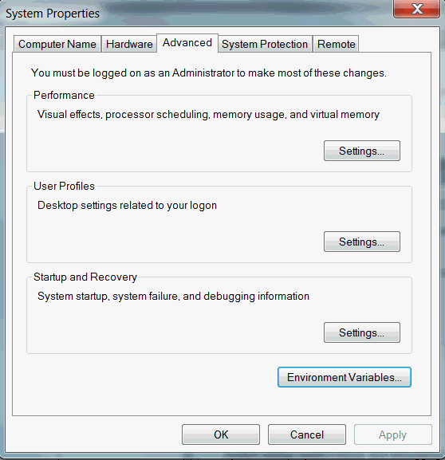

<div align=center>
 
 <br>
 
 
 
 
</div>


# Welcome

Have you ever wanted to create a website from your *Markdown* just with the click of a button? Then I welcome you to Pond, a fully customizable and flexible static website generator inspired by [Django](https://docs.djangoproject.com/en/3.0/ref/templates/language/)’s *(or [Jinja](https://jinja.palletsprojects.com/en/2.11.x/)'s)* templates.

Pond let's you write everything in Markdown and instantly produce a complete website of your liking ready for publication.


> ## Install
>
> You can [download the latest version](https://github.com/WilliamRagstad/Pond/releases/latest), or [view all releases](https://github.com/WilliamRagstad/Pond/releases).
>
> If you want to use Pond in other projects, read how you can [install Pond to PATH](#install-pond-to-path).
>
> ---


# CLI usage

```bash
Pond Command Line 1.0.0.0

Usage: Pond (options) (commands)

Options:
¨¨¨¨¨¨¨¨
  /c [file]  Configuration file

Commands:
¨¨¨¨¨¨¨¨¨
  init    Initialize a new Pond project

```


## Configuration

As promised, Pond comes with with extensive customization and flexibility so you can have as much freedom as possible when designing your templates.

You write all the content in Markdown, which is then combined with the correct HTML template and CSS stylesheet to produce a finished page.

[This is not yet written]


## Template Syntax

### Global variables

All global variables are **UPPERCASE**.
These are:

| Name     | Description                 | Type              |
| -------- | --------------------------- | ----------------- |
| TITLE    | The article title           | **Text**          |
| CHAPTERS | Data about all chapter      | **Chapter** array |
| ELEMENTS | All elements in the article | **Element** array |


### Template tags

Tags formatted as `{{ [expression] }}` will produce a text result. If you desire to utilize some kind of compile-time action, these are formatted as `` and will produce different results depending on the action type described by the expression.

### Arrays

All object arrays can be directly indexed in using `[]` notation starting from 0. So to get the second item in an array you'll write `array[1]`.

### Pipes

#### Raw HTML

Use the `{{ [expression] | raw }}` notation to print out the result of the expression as raw HTML. This may be unsafe if users can control the expression value. 

### Actions

#### Loops

Use the `` notation for iterating over a text array. Remember to always add the corresponding closing `` .


## Objects

| Type        | Description                              | Fields                                       | Methods  |
| ----------- | ---------------------------------------- | -------------------------------------------- | -------- |
| **Chapter** | Holds data about each and every chapter. | title: **Text**, elements: **Element** array |          |
| **Element** | Text, Images, Quotes, etc.               |                                              | toHTML() |


## Methods

| Name     | Description                                                  |
| -------- | ------------------------------------------------------------ |
| toHTML() | Returns the default HTML implementation of the specific **Element**. |


## Example page

Markdown article:

```markdown
# My fancy title
## Welcome
Lorem ipsum dolor sit amet, consectetur adipiscing elit. Praesent tincidunt metus ac velit facilisis elementum. Nam iaculis sagittis ante, non rhoncus risus mattis at. Integer semper felis ac pretium placerat. Maecenas placerat ipsum ut odio egestas, rutrum gravida velit suscipit. Sed ornare, sapien non ornare ultrices, mi mauris ullamcorper magna, eget sollicitudin nibh tellus ac nunc. Curabitur tempus ornare ornare. Pellentesque urna diam, bibendum nec urna tristique, malesuada iaculis odio. Integer finibus magna ac nunc scelerisque commodo. Nunc porta massa quis est porttitor lobortis. Quisque finibus lorem vitae ante consequat tincidunt. Aliquam efficitur eros vitae ligula tempor, a interdum ex aliquet. Mauris nibh nibh, mollis vitae est quis, tempus sollicitudin mauris. Vestibulum cursus, ligula sit amet sodales venenatis, orci sem sagittis est, eu mattis orci tellus a nibh. Vestibulum tempus lacus sed nunc imperdiet porttitor. Morbi gravida ullamcorper fermentum.


## The end
Praesent cursus elit id lacus hendrerit, ac interdum ante euismod. Interdum et malesuada fames ac ante ipsum primis in faucibus. Sed sollicitudin suscipit hendrerit. Pellentesque faucibus eget eros at auctor. Ut pulvinar ante vel neque dignissim, gravida pulvinar felis pellentesque. Ut fermentum molestie efficitur. Praesent molestie vehicula enim vitae tincidunt. Quisque vel pellentesque dui. Morbi a arcu nulla. Nullam aliquet vel quam et vehicula. Aliquam erat volutpat.
```

HTML Template:

```django
<html>
    <head>
        <title>Here is {{ TITLE }}</title>
    </head>
    <body>
        <h1> {{ TITLE }} </h1>
        
        	<h2> {{ chapter.title }} </h2>
        	
        		{{ element.toHTML() | raw }}
        		{# This line above does the same thing as the commented row below. #}
        		{#
        		
        			
        				<p> {{ element.text }} </p>
        			
        			
        				
        			
        		
        		#}
        	
        
    </body>
</html>
```

Produces:

```html
<html>
    <head>
        <title>Here is My fancy title</title>
    </head>
    <body>
        <h1> My fancy title </h1>
        <h2> Welcome </h2>
        <p> Lorem ipsum dolor sit amet, consectetur adipiscing elit. Praesent tincidunt metus ac velit facilisis elementum. Nam iaculis sagittis ante, non rhoncus risus mattis at. Integer semper felis ac pretium placerat. Maecenas placerat ipsum ut odio egestas, rutrum gravida velit suscipit. Sed ornare, sapien non ornare ultrices, mi mauris ullamcorper magna, eget sollicitudin nibh tellus ac nunc. Curabitur tempus ornare ornare. Pellentesque urna diam, bibendum nec urna tristique, malesuada iaculis odio. Integer finibus magna ac nunc scelerisque commodo. Nunc porta massa quis est porttitor lobortis. Quisque finibus lorem vitae ante consequat tincidunt. Aliquam efficitur eros vitae ligula tempor, a interdum ex aliquet. Mauris nibh nibh, mollis vitae est quis, tempus sollicitudin mauris. Vestibulum cursus, ligula sit amet sodales venenatis, orci sem sagittis est, eu mattis orci tellus a nibh. Vestibulum tempus lacus sed nunc imperdiet porttitor. Morbi gravida ullamcorper fermentum. </p>
        
        <h2> The end </h2>
        <p> Praesent cursus elit id lacus hendrerit, ac interdum ante euismod. Interdum et malesuada fames ac ante ipsum primis in faucibus. Sed sollicitudin suscipit hendrerit. Pellentesque faucibus eget eros at auctor. Ut pulvinar ante vel neque dignissim, gravida pulvinar felis pellentesque. Ut fermentum molestie efficitur. Praesent molestie vehicula enim vitae tincidunt. Quisque vel pellentesque dui. Morbi a arcu nulla. Nullam aliquet vel quam et vehicula. Aliquam erat volutpat. </p>
    </body>
</html>
```

Easy huh? Just build your own templates to get started!


# Install Pond to PATH

This is for those who are going to use Pond in more than one projects, or just like to keep their files organized.

First, [download Pond](#install) and unzip the package. Create a folder in your desired location, we suggest `C:\Program Files (x86)\Pond`, and move the content files from the zip into this folder. Next, click on the windows home icon in the bottom left corner, and serach `Environment Variables` . The window should look like the one below. 

<div align=center>
    
</div>


Click the button at the bottom that says `Environment Variables`. This window should pop up.

<div align=center>
    
</div>

Now, look for the variable `Path`, click `Edit...` and `New`.  Now paste the location in which you put all Pond files, ours was `C:\Program Files (x86)\Pond`. Press `OK` everywhere.

Now you have installed Pond globally on your computer. Open up a terminal and type `Pond` to test it out.


